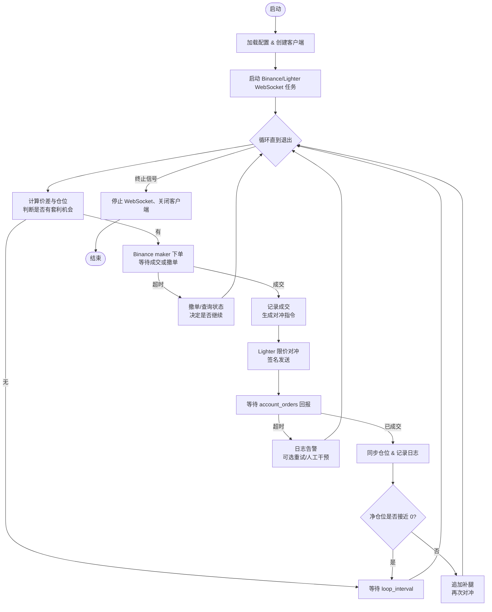

# Binance × Lighter 套利业务流程

## 策略概览

- **Binance leg（maker）**：借鉴 `perp_arb_bot.py` 的流程，在币安挂限价单以获取手续费优惠与主动权。
- **Lighter leg（taker/hedge）**：复用 `hedge_mode.py` 对 Lighter 的 WebSocket 管理、滑点控制与成交确认逻辑，作为 Binance 成交后的对冲腿。
- **目标**：在两个平台间执行双腿套利（或刷量），确保仓位对冲、滑点可控、订单状态可观测。

## 核心流程

- **初始化阶段**

  - 加载配置：币种、合约 ID、下单规模限制、滑点阈值、循环周期等。
  - 创建 Binance/Lighter 客户端：
    - Binance 使用工厂模式初始化，读取合约参数、tick size、下单限制。
    - Lighter 创建 `SignerClient`，查询 `market_index`、`price_multiplier`、`base_amount_multiplier`。
  - 注册通知/日志接口，便于后续状态上报。

- **WebSocket 与市场数据**

  - **Binance leg**：沿用 `perp_arb_bot.py` 中的深度/订单更新获取机制，确保有实时 BBO、成交回报。
  - **Lighter leg**：
    - `handle_lighter_ws` 风格任务：订阅 `order_book/{market}` 与 `account_orders/...`，维护本地 order book 状态。
    - 检查 offset 连续性、校验数据合法性，若出现缺口则重新请求快照。
    - 将成交数据交由 `_handle_lighter_fill`，更新持仓并触发事件通知。

- **机会识别**

  - 参考 `perp_arb_bot.py` 的 `_compute_opportunity`：
    - 比较 Binance 与 Lighter BBO，计算方向差价。
    - 判断是否符合开仓/平仓门槛、持仓是否在允许范围内。

- **执行循环**

  1. **Binance maker 下单（借鉴 `_place_orders_with_retry` 前半段）**
     - 先下限价订单，设定超时时间。
     - 若超时，优先撤单，必要时查询订单状态判断是否部分成交。
     - 成功成交后记录成交量/价格，准备对冲指令。
  2. **Lighter 对冲（参考 `place_lighter_market_order` 与 `monitor_lighter_order`）**
     - 根据 Binance 成交方向确定 Lighter 买卖方向。
     - 从 websocket 更新中取最优价，按 `lighter_slippage_pct` 调整（偏离 0.2% 左右）。
     - 通过 SignerClient 签名、发送限价单，启动监控任务等待成交回报。
     - 若 30 秒内无成交回报，执行 fallback：日志告警、视情况重试或标记人工处理。
  3. **状态同步**
     - 双腿完成后更新净持仓、记录交易明细（CSV/日志）。
     - 若仓位仍不平衡，则追加“补腿”逻辑重试，直到仓位回到安全范围。

- **风控与终止**
  - 定期检查仓位差异（类似 `_check_mismatch`），超出阈值时触发告警或退出。
  - 监听用户中断信号，调用 `shutdown()` 取消 WebSocket 任务、关闭客户端。

## 流程图

## 关键借鉴点

- **Binance leg**：`perp_arb_bot.py` 中的 `_fetch_depths`、`_check_arb_conditions`、`_place_orders_with_retry`。
- **Lighter leg**：`hedge_mode.py` 中的 `handle_lighter_ws`、`place_lighter_market_order`、`monitor_lighter_order`、`handle_lighter_order_result`。
- **风险控制**：仓位不平衡检查、超时 Fallback、WebSocket 数据完整性验证。
